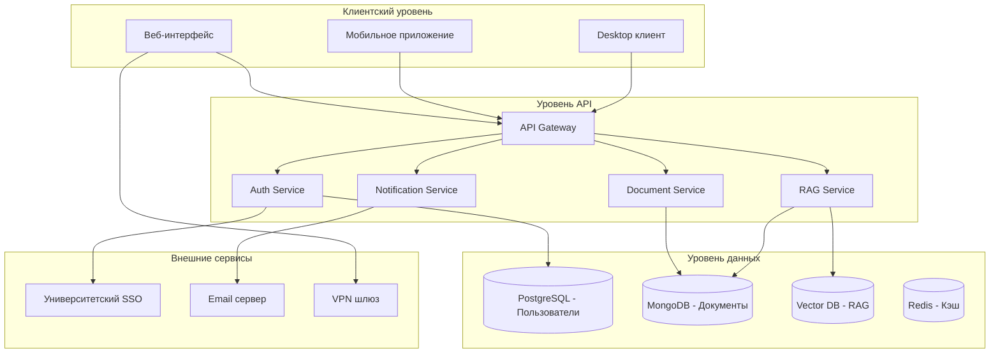
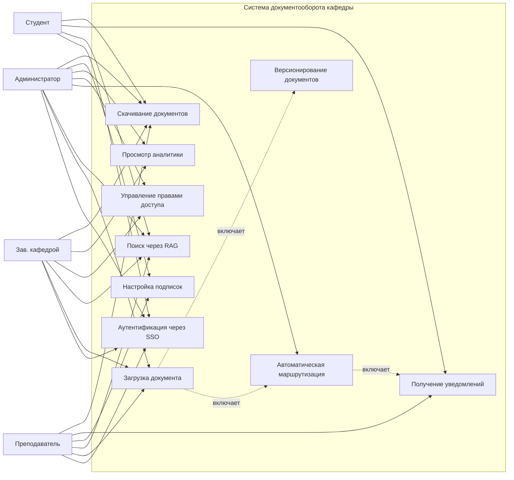
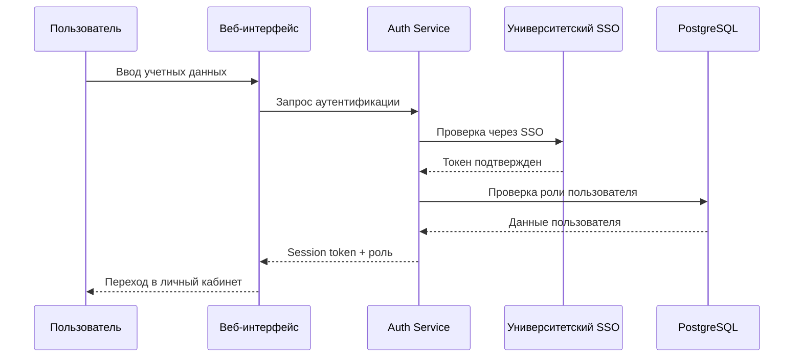
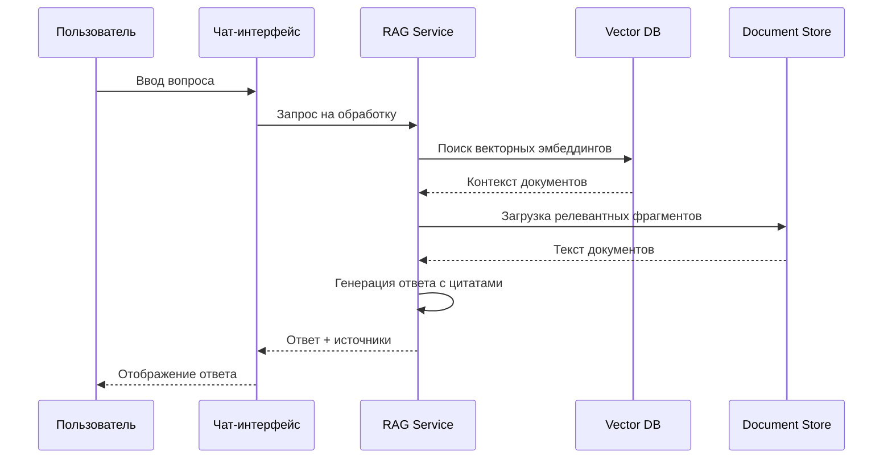
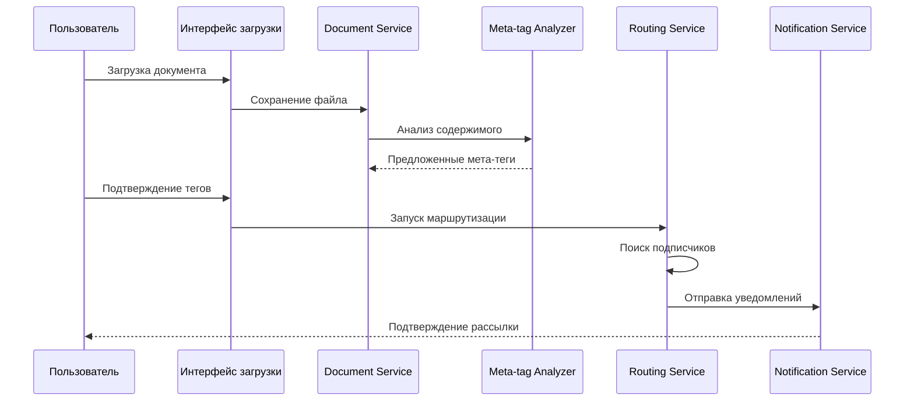

# Учреждение образования
«БЕЛОРУССКИЙ ГОСУДАРСТВЕННЫЙ УНИВЕРСИТЕТ 
ИНФОРМАТИКИ И РАДИОЭЛЕКТРОНИКИ»
Кафедра интеллектуальных информационных технологий
Отчет по практическому занятию 
по курсу
«Проектирование защищенных интеллектуальных информационных систем»
на тему: 
« Разработка системы "Поддержка документооборота кафедры" »
Минск, 2026

## Тема проекта: 
Система поддержки документооборота кафедры с элементами RAG и автоматической маршрутизации.

## Предпосылки для ведения бизнеса
Система поддержки документооборота кафедры имеет ряд преимуществ перед традиционными методами (аналоги: электронная почта, общие сетевые папки, SharePoint):
1.  **Централизованное хранение.** Все документы кафедры находятся в едином защищенном репозитории.
2.  **Интеллектуальный поиск (RAG).** Возможность задавать вопросы системе на естественном языке и получать ответы на основе содержимого документов, а не только по ключевым словам.
3.  **Автоматическая маршрутизация.** Система автоматически определяет получателей документа на основе его типа, содержания и роли загружающего, уменьшая человеческий фактор.
4.  **Контроль версий и доступа.** Четкое разграничение прав доступа для студентов, преподавателей и администрации.
5.  **Аналитика загрузки.** Возможность отслеживать нагрузку на сотрудников при распределении задач через документы.

## Бизнес-цель: 
Автоматизация процессов документооборота кафедры, снижение времени на поиск информации и обеспечение доставки документов целевым получателям без участия оператора.

## Задачи
1.  Обезопасить документы кафедры от потери и несанкционированного доступа.
2.  Сократить время поиска информации за счет внедрения RAG-ассистента.
3.  Исключить случаи недоставки важных документов сотрудникам и студентам за счет автоматической рассылки.
4.  Обеспечить актуальность версий документов для всех участников процесса.

## Критерий успеха 1:
Не менее 80% документооборота кафедры должно осуществляться через систему к окончанию тестового периода.

## Критерий успеха 2:
Обеспечить точность автоматической маршрутизации документов на уровне 90% к окончанию тестового периода*.
И 95% в течение первого года после релиза. И более 97% в течение последующих 3 лет.

*\*Тестовый период представляет собой 3 месяца использования системы с реальными документами кафедры. Во время тестового периода система работает в режиме дублирования (параллельно с обычными каналами связи). Ответственность за недоставку документов в тестовый период лежит на отправителе.*

## Фактор бизнес-риска-1
Возможность ошибок работы AI-модуля (RAG), предоставление неверной информации на основе документов.
**Способы преодоления.**
Внедрение механизма подтверждения источников. При ответе система указывает ссылки на конкретные документы и страницы. Возможность пометки ответа пользователем как "Верно/Неверно" для дообучения модели. Ограничение доступа к генерации ответов для критически важных документов только для утвержденных лиц.

## Фактор бизнес-риска-2
Сопротивление сотрудников внедрению новой системы автоматической рассылки (недоверие к автоматике).
**Способы преодоления.**
User friendly интерфейс, разработанный с учетом рабочих процессов кафедры. Наличие режима "Предпросмотр рассылки" перед отправкой документа, где пользователь видит список получателей, предложенных системой, и может его скорректировать. Наличие документации (help) и режима обучения внутри системы.

## Функции и возможности системы

### 1. Регистрация и управление ролями.
Система поддерживает роли: "Заведующий кафедрой", "Администратор", "Преподаватель", "Методист", "Студент". Регистрация сотрудников осуществляется администратором на основе списков кафедры. Студенты регистрируются через привязку к номеру зачетной книжки и корпоративной почте.

| Воздействие | Администратор входит в панель управления, выбирает пункт "Добавить пользователя". Заполняет данные (ФИО, роль, email). |
| ----------- | ---------------------------------------------------------------------------------------------------------------------- |
| Реакция     | Система проверяет уникальность email. Создает учетную запись. Отправляет приглашение на почту с временным паролем.     |
| Воздействие | Пользователь переходит по ссылке, вводит временный пароль и задает новый.                                              |
| Реакция     | Система активирует аккаунт, запрашивает настройку двухфакторной аутентификации (опционально).                          |

### 2. Загрузка документа с мета-тегами.
Пользователь загружает документ. Система предлагает автоматически заполнить мета-теги (тип документа, кафедра, учебный год, группа) на основе анализа содержимого.

| Воздействие | Пользователь перетаскивает файл в область загрузки. |
| --- | --- |
| Реакция | Система сканирует файл, предлагает предзаполненные мета-теги. Пользователь подтверждает или редактирует их. |
| Воздействие | Пользователь нажимает кнопку "Опубликовать". |
| Реакция | Система сохраняет файл, индексирует его для RAG, запускает процесс маршрутизации. |

### 3. Интеллектуальный поиск (RAG-ассистент).
Пользователь задает вопрос в чат-интерфейсе. Система ищет контекст в базе документов и формирует ответ.

| Воздействие | Пользователь вводит вопрос: "Когда срок сдачи ведомостей?" |
| --- | --- |
| Реакция | Система выполняет поиск по векторному индексу документов, генерирует ответ с цитированием источников. |
| Воздействие | Пользователь нажимает на ссылку источника в ответе. |
| Реакция | Система открывает документ на соответствующей странице. |

### 4. Автоматическая маршрутизация документов.
Система определяет подписчиков на основе правил (например, все преподаватели курса, все студенты группы).

| Воздействие | Система анализирует мета-теги загруженного документа. |
| --- | --- |
| Реакция | Система сопоставляет теги со списком подписок пользователей. Формирует список получателей. |
| Воздействие | (Автоматически) Система отправляет уведомления получателям. |
| Реакция | Пользователи получают уведомление на email и в личный кабинет системы о новом документе. |

### 5. Управление подписками.
Пользователь может настроить, документы каких типов и категорий он хочет получать автоматически.

| Воздействие | Пользователь заходит в настройки профиля, раздел "Подписки". |
| --- | --- |
| Реакция | Система отображает список доступных категорий (Приказы, Методички, Расписания). |
| Воздействие | Пользователь выбирает категории и сохраняет. |
| Реакция | Система обновляет правила маршрутизации для данного пользователя. |

### 6. Версионирование документов.
При загрузке файла с тем же именем и мета-тегами система предлагает создать новую версию.

| Воздействие | Пользователь загружает файл с именем, совпадающим с существующим. |
| --- | --- |
| Реакция | Система предупреждает о конфликте, предлагает создать версию v2. |
| Воздействие | Пользователь подтверждает создание версии. |
| Реакция | Система сохраняет новую версию, предыдущую помечает как архивную, уведомляет подписчиков об обновлении. |

### 7. Аналитика загрузки сотрудников.
Администратор видит статистику по количеству обработанных документов каждым сотрудником.

| Воздействие | Администратор открывает панель "Аналитика". |
| --- | --- |
| Реакция | Система отображает графики нагрузки по отделам и сотрудникам за выбранный период. |

### 8. Отзыв доступа.
Администратор может отозвать доступ к документу для конкретных пользователей или групп.

| Воздействие | Администратор выбирает документ, нажимает "Управление доступом", выбирает пользователя и жмет "Запретить". |
| --- | --- |
| Реакция | Система немедленно скрывает документ из списка пользователя, отправляет уведомление об отзыве доступа. |

### 9. Экспорт документов.
Возможность выгрузки документов в форматах PDF, DOCX для локального хранения.

| Воздействие | Пользователь открывает документ, нажимает "Скачать". |
| --- | --- |
| Реакция | Система формирует файл и initiates загрузку на устройство пользователя. |

### 10. Уведомления о дедлайнах.
Система анализирует документы с датами (например, сроки сдачи) и напоминает ответственным лицам.

| Воздействие | (Автоматически) Система сканирует базу документов ежедневно. |
| --- | --- |
| Реакция | При приближении дедлайна (за 3 дня, за 1 день) система отправляет push-уведомление и email ответственному лицу. |

## Требования к сопровождению
Сопровождение предполагает получение обратной реакции от пользователей, которая будет разделена на следующие категории:
1.  Критические ошибки (не работает поиск, не приходят уведомления).
2.  Ошибки контента (RAG выдал неверную информацию).
3.  Пожелания пользователей к следующим версиям продукта.

При отправке обратной реакции пользователю необходимо выбрать категорию.
**Критические ошибки** обрабатываются в течение 4 часов.
**Ошибки контента** рассматриваются командой методистов и корректируются в базе знаний в течение 1 рабочего дня.
**Пожелания пользователей** выносятся на обсуждение при планировании следующей версии системы.
Версии продукта выходят каждые 2 месяца с исправлениями и доработками.
Глобальные версии (с изменением модели AI) могут выходить не чаще 1 раза в год.
Новые версии доступны сотрудникам кафедры с действующим учетным записью.

## Проектные ограничения
*   **Язык программирования:** Python (Backend, AI), C++ (Высоконагруженные модули обработки), JavaScript (Frontend).
*   **Шаблон проектирования:** MVC.
*   **Модель ЖЦ:** Итерационная.
*   **Система контроля версий:** Git.
*   **Ограничение системы:** Работа только внутри контура университета (Intranet) или через VPN. Система не предоставляет услуги внешним организациям.

## Квалификационные требования

| Должность | Требования |
| --- | --- |
| Главный администратор (Зав. кафедрой) | Полный доступ ко всем документам. Управление правами администраторов. Утверждение критических документов. |
| Администратор системы | Техническая поддержка, управление пользователями, настройка правил маршрутизации, мониторинг работы RAG. |
| Преподаватель / Сотрудник | Загрузка документов, работа с RAG, получение уведомлений, редактирование документов в рамках своих полномочий. |
| Студент | Только чтение документов, доступных для их группы/курса. Поиск через RAG без возможности загрузки. |

## Требования пользователя
Данная система разрабатывается для внутренней автоматизации кафедры. Аналогами являются системы типа Directum, DocsVision, однако они требуют сложной настройки правил. Система "Поддержка документооборота кафедры" фокусируется на интеллектуальной обработке (RAG) и упрощенной автоматической маршрутизации, специфичной для учебного процесса.

## Разработка и анализ требований по безопасности системы

### Требования к безопасности:
1.  Доступ к системе только для авторизованных сотрудников и студентов университета.
2.  Все документы шифруются при хранении.
3.  RAG-модель не использует данные для обучения на внешних серверах (Local LLM или защищенный API).
4.  Разграничение доступа согласно ролевой модели.
5.  Логирование всех действий с документами (кто, когда, что сделал).
6.  Автоматическое завершение сессии при неактивности.
7.  Резервное копирование данных ежедневно.
8.  Деактивация учетной записи при отчислении студента или увольнении сотрудника.

|                   | Определение правила                                                                                | Тип правила      | Статическое или динамическое | Источник                   |
| -------------------- | -------------------------------------------------------------------------------------------------- | ---------------- | ---------------------------- | -------------------------- |
| **Бизнес-правило-1** | Для доступа к системе необходима авторизация через единый контур университета (SSO).               | Ограничение      | Статическое                  | Политика безопасности ВУЗа |
| **Бизнес-правило-2** | Загрузка документов возможна только для ролей "Преподаватель", "Администратор", "Зав. кафедрой".   | Ограничение      | Статическое                  | Регламент кафедры          |
| **Бизнес-правило-3** | Студенты имеют право только на чтение документов, помеченных как "Доступно студентам".             | Ограничение      | Статическое                  | Регламент кафедры          |
| **Бизнес-правило-4** | Автоматическая рассылка осуществляется только после подтверждения мета-тегов загружающим.          | Порядок действий | Динамическое                 | Алгоритм работы системы    |
| **Бизнес-правило-5** | При изменении документа все предыдущие версии сохраняются в архиве с меткой времени.               | Ограничение      | Статическое                  | Политика версионирования   |
| **Бизнес-правило-6** | RAG-ассистент не имеет права выдавать доступ к файлам, только предоставлять информацию из них.     | Ограничение      | Статическое                  | Политика безопасности      |
| **Бизнес-правило-7** | Доступ к системе возможен только с устройств, подключенных к сети университета или через VPN.      | Ограничение      | Динамическое                 | Сетевая политика           |
| **Бизнес-правило-8** | При увольнении сотрудника HR-система отправляет сигнал на деактивацию аккаунта в течение 24 часов. | Порядок действий | Динамическое                 | Договор с отделом кадров   |
| **Бизнес-правило-9** | Критические документы (приказы) требуют цифровой подписи Зав. кафедрой для публикации.             | Ограничение      | Статическое                  | Регламент документооборота |

---

## Практическое занятие 4

Каждый пользователь проходит аутентификацию, после чего, в зависимости от типа пользователя (Зав. кафедрой, Администратор, Преподаватель, Студент), начинает работу с системой, как показано на Рисунке 1:

**Рисунок 1. Описание функциональной архитектуры системы.**

---

На Рисунке 2 изображена диаграмма, отображающая типы пользователей и их возможности в системе.

**Рисунок 2. Диаграмма действий пользователей**

```mermaid
graph TD
    subgraph "Зав. кафедрой"
        A1[Управление правами]
        A2[Утверждение документов]
        A3[Просмотр аналитики]
        A4[Доступ ко всем документам]
    end
    
    subgraph "Администратор системы"
        B1[Управление пользователями]
        B2[Настройка маршрутизации]
        B3[Мониторинг RAG]
        B4[Техническая поддержка]
    end
    
    subgraph "Преподаватель / Сотрудник"
        C1[Загрузка документов]
        C2[Поиск через RAG]
        C3[Получение уведомлений]
        C4[Редактирование документов]
    end
    
    subgraph "Студент"
        D1[Чтение документов]
        D2[Поиск через RAG]
        D3[Получение уведомлений]
        D4[Скачивание файлов]
    end
    
    A1 --> A2
    A2 --> A3
    A3 --> A4
    B1 --> B2
    B2 --> B3
    B3 --> B4
    C1 --> C2
    C2 --> C3
    C3 --> C4
    D1 --> D2
    D2 --> D3
    D3 --> D4
```

---

На Рисунке 3 изображена use case диаграмма верхнего уровня, отображающая основные возможности системы, а также определение ролей.

**Рисунок 3. Диаграмма вариантов использования верхнего уровня.**

## Требования к внешнему и внутреннему интерфейсу
Взаимодействие между модулями системы осуществляется с помощью HTTPS.
Загрузка и скачивание файлов осуществляется с помощью защищенного протокола передачи файлов (SFTP/HTTPS).
Минимальная скорость передачи данных внутри локальной сети: 100 мегабит в секунду.
Механизмы согласования и синхронизации: Синхронизация статусов документов в реальном времени (WebSocket).
Ограничение по формату файлов: PDF, DOCX, XLSX, TXT, PNG, JPG.
Рассмотрим внутренние модули системы. На Рисунке 4 изображена диаграмма последовательности процесса аутентификации пользователя.

**Рисунок 4. Диаграмма последовательности процесса аутентификации пользователя**

---
На рисунке 5 изображена диаграмма последовательности работы RAG-ассистента (запрос-ответ).

**Рисунок 5: Диаграмма последовательности работы RAG-ассистента**

---
Диаграмма последовательности на Рисунке 6 демонстрирует процедуру автоматической маршрутизации документа.

**Рисунок 6. Диаграмма последовательности установки прав и маршрутизации.**

*\* return возвращает либо положительный ответ, либо отрицательный ответ проверки/выполнения операции*

## Пользовательский интерфейс
### Требования
Графический интерфейс должен соответствовать ISO 9241-171:2008:
Эргономика взаимодействия человека и системы. Часть 171. Руководство по доступности программного обеспечения.

Ожидаемый внешний интерфейс аутентификации представлен на Рисунке 7.

**Рисунок 7. Ожидаемый пользовательский интерфейс для аутентификации**
![[auth.png]]

Ожидаемый внешний интерфейс для работы с документами представлен на Рисунке 8.

**Рисунок 8. Ожидаемый пользовательский интерфейс для работы с документами**
![[documents.png]]

Ожидаемый внешний интерфейспоиска по содержанию документов представлен на Рисунке 9.

**Рисунок 9. Ожидаемый пользовательский интерфейс для поиска по содержанию документов**
![[rag_serach.png]]

Ожидаемый внешний интерфейспоиска по содержанию документов представлен на Рисунке 10.

**Рисунок 10. Ожидаемый пользовательский интерфейс для главной страницы**
![[dashboard.png|637]]

