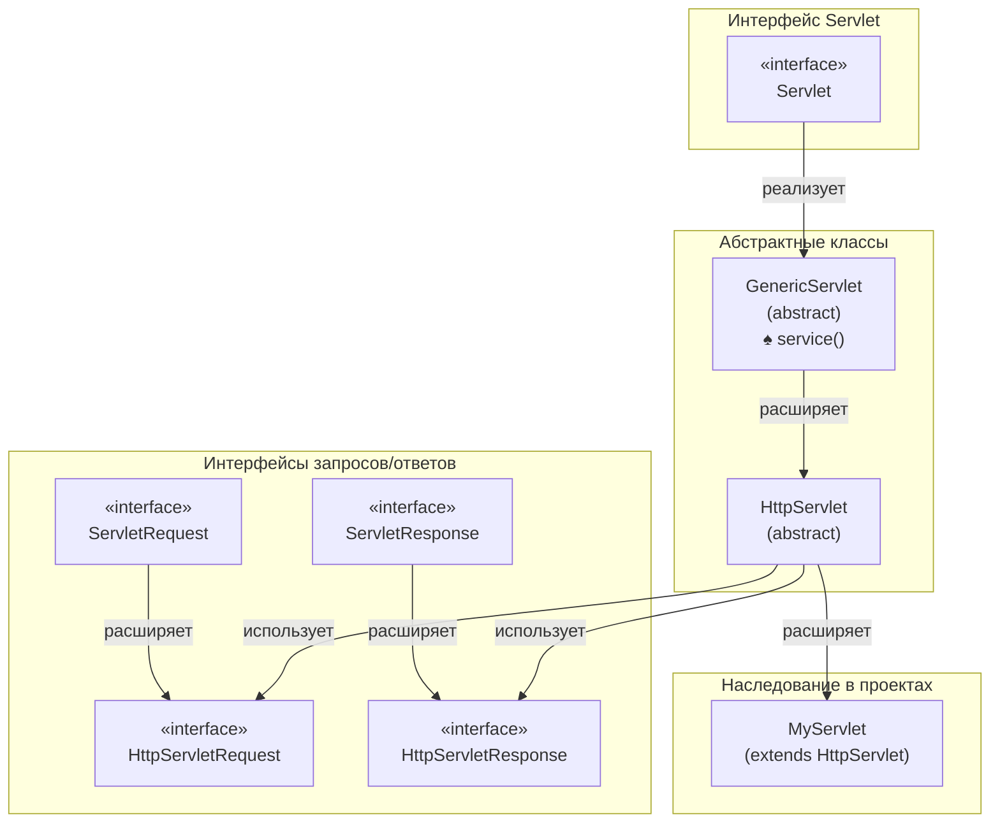

![[image-16.png]]
Иерархия классов сервлетов в Java построена вокруг двух основных пакетов: базового `javax.servlet` (или `jakarta.servlet` в новых версиях) и `javax.servlet.http`, который добавляет поддержку протокола HTTP .

Вот схема, которая наглядно показывает, как связаны основные классы и интерфейсы:

А теперь давайте разберем каждый элемент подробнее.

###  Верхний уровень: Интерфейс `Servlet`

На самом верху иерархии находится интерфейс `javax.servlet.Servlet` . Он определяет фундаментальные методы, которые управляют жизненным циклом любого сервлета и должны быть реализованы всеми классами сервлетов :
*   `init(ServletConfig config)`: вызывается контейнером после создания сервлета для его инициализации .
*   `service(ServletRequest req, ServletResponse res)`: вызывается для обработки каждого запроса клиента .
*   `destroy()`: вызывается перед удалением сервлета, чтобы освободить ресурсы .

###  Абстрактные классы: Удобная основа

Поскольку напрямую реализовывать интерфейс `Servlet` неудобно, API предлагает два абстрактных класса-помощника, которые берут на себя рутинную работу .

#### `javax.servlet.GenericServlet`
Этот класс находится в пакете `javax.servlet` и является первым уровнем абстракции . Он реализует интерфейсы `Servlet` и `ServletConfig` .
*   **Назначение**: не зависит от какого-либо протокола. Он подходит для сервлетов, работающих, например, с FTP или почтовыми протоколами .
*   **Что сделано**: предоставляет базовую реализацию методов `init()` и `destroy()`, а также всех методов `ServletConfig` для доступа к параметрам и контексту сервлета .
*   **Что нужно сделать разработчику**: единственный метод, который оставлен абстрактным — это `service(ServletRequest, ServletResponse)`. Разработчик, расширяющий `GenericServlet`, обязан его реализовать .

#### `javax.servlet.http.HttpServlet`
Это самый важный класс для веб-разработчиков. Он находится в пакете `javax.servlet.http` и расширяет класс `GenericServlet` .
*   **Назначение**: добавляет поддержку протокола HTTP . Подавляющее большинство сервлетов в веб-приложениях наследуются именно от него .
*   **Что сделано**:
    *   Переопределяет метод `service(ServletRequest, ServletResponse)` и преобразует объекты запроса и ответа в их HTTP-специфичные версии — `HttpServletRequest` и `HttpServletResponse` .
    *   Вводит новый метод `service(HttpServletRequest, HttpServletResponse)`. Этот метод анализирует HTTP-метод (GET, POST, PUT и т.д.) запроса и вызывает соответствующий метод-обработчик .
    *   Предоставляет набор методов-заглушек для каждого типа HTTP-запроса: `doGet()`, `doPost()`, `doPut()`, `doDelete()` и другие .
*   **Что нужно сделать разработчику**: переопределить конкретный метод `doXxx()` (например, `doGet()` или `doPost()`), чтобы реализовать нужную логику для этого типа запроса. Переопределять сам `service()` обычно не требуется .

###  Вспомогательные классы и интерфейсы

В этой иерархии важную роль играют объекты-помощники, которые передаются в методы сервлетов :
*   **`ServletRequest` / `HttpServletRequest`**: интерфейсы для чтения данных от клиента. `HttpServletRequest` добавляет методы для работы с cookies, HTTP-сессиями, заголовками и параметрами URL .
*   **`ServletResponse` / `HttpServletResponse`**: интерфейсы для формирования ответа клиенту. `HttpServletResponse` позволяет устанавливать HTTP-заголовки, коды ответа и cookies .

Таким образом, **классовая иерархия сервлетов** — это продуманная структура от общего к частному: от интерфейса `Servlet` через протокол-независимый `GenericServlet` к специализированному `HttpServlet`, который и используется в веб-программировании.

Чтобы написать свой первый сервлет, вам будет достаточно унаследовать класс от `HttpServlet` и переопределить методы `doGet()` или `doPost()`. Хотите перейти к практическому примеру?