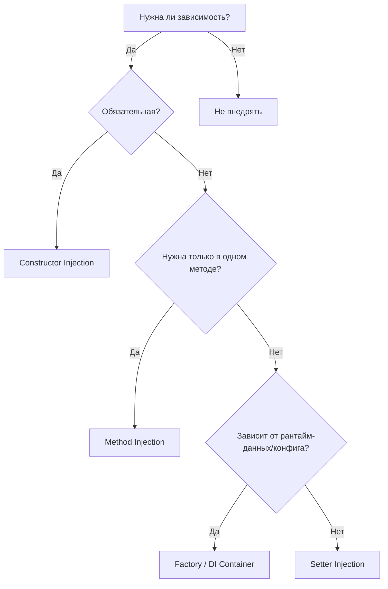

#  Механизмы реализации DIP (Dependency Inversion Principle)

Принцип DIP отвечает на вопрос **«что делать»** (инвертировать направление зависимости), но не говорит **«как это сделать технически»**. Механизмы DIP — это конкретные паттерны и техники передачи абстракций в зависимые компоненты. Выбор механизма влияет на тестируемость, читаемость и эволюцию архитектуры.

Ниже разобраны все основные механизмы с примерами, плюсами/минусами и правилами применения.

---
## 1 Constructor Injection (Внедрение через конструктор)
Самый рекомендуемый и безопасный механизм. Все обязательные зависимости передаются при создании объекта.

```python
class OrderProcessor:
    def __init__(self, payment_gateway: PaymentGateway, logger: Logger):
        self.payment_gateway = payment_gateway
        self.logger = logger
        # объект гарантированно готов к работе сразу после создания
```

 **Плюсы:**
- Явный контракт: сигнатура конструктора = список требований класса
- Гарантированная инициализация: объект не может оказаться в неконсистентном состоянии
- Идеально для юнит-тестов: легко подставить mock/stub
- Поддержка иммутабельности (`final`/`@dataclass(frozen=True)`)

**Минусы:**
- При >5-7 зависимостях конструктор становится «тяжёлым» (сигнал к нарушению SRP)
- Не подходит для опциональных или контекстных зависимостей

 **Когда использовать:** По умолчанию для всех обязательных зависимостей.

---
## 2 Setter / Property Injection (Внедрение через свойство)
Зависимость присваивается после создания объекта через атрибут или метод-сеттер.

```python
class ReportGenerator:
    def __init__(self):
        self.formatter: Formatter = DefaultFormatter()  # дефолт

    @property
    def formatter(self) -> Formatter:
        return self._formatter

    @formatter.setter
    def formatter(self, value: Formatter):
        self._formatter = value
```

 **Плюсы:**
- Позволяет задавать опциональные зависимости
- Удобно для переключения реализации на лету (A/B тесты, feature flags)
- Может разрывать циклические зависимости

 **Минусы:**
- Скрывает реальные требования класса
- Риск использования до инициализации (`None`, дефолты)
- Нарушает принцип «fail-fast»

 **Когда использовать:** Только для **необязательных** зависимостей или в legacy-коде, где нельзя менять конструктор.

---
## 3 Method / Parameter Injection (Внедрение через параметр метода)
Зависимость передаётся напрямую в метод, который её использует.

```python
class AnalyticsService:
    def generate_daily_report(self, date: date, exporter: ReportExporter):
        data = self.fetch(date)
        exporter.export(data)  # зависимость нужна только здесь
```

 **Плюсы:**
- Чёткая область видимости: зависимость существует только на время вызова
- Не раздувает состояние объекта
- Идеально для контекстных объектов (запрос, транзакция, логгер операции)

 **Минусы:**
- Загромождает сигнатуры методов
- Неудобен, если зависимость нужна в нескольких методах класса

 **Когда использовать:** Для зависимостей, специфичных для одного действия или запроса.

---
## 4 Factory Pattern (Фабрика зависимостей)
Класс зависит не от конкретной реализации, а от фабрики, которая создаёт её по запросу.

```python
class NotificationDispatcher:
    def __init__(self, provider_factory: NotificationProviderFactory):
        self.factory = provider_factory

    def send(self, channel: str, message: str):
        provider = self.factory.create(channel)  # EmailProvider, SMSProvider, etc.
        provider.send(message)
```

 **Плюсы:**
- Позволяет выбирать реализацию на основе рантайм-данных
- Инкапсулирует логику создания/кэширования/пулинга
- Ленивая инициализация (экономит ресурсы)

 **Минусы:**
- Добавляет слой абстракции
- Может скрывать реальные зависимости, если фабрика становится «божественным объектом»

 **Когда использовать:** Когда выбор реализации зависит от конфигурации, входных данных или состояния системы.

---
## 5 DI-контейнеры / IoC-фреймворки
Автоматизированное управление графом зависимостей. Контейнер разрешает абстракции в конкретные реализации по зарегистрированным правилам.

```python
# Пример: dependency-injector (Python)
from dependency_injector import containers, providers
from dependency_injector.wiring import Provide, inject

class Container(containers.DeclarativeContainer):
    config = providers.Configuration()
    logger = providers.Singleton(Logger, name="app")
    db = providers.Singleton(PostgresDB, dsn=config.db.dsn)
    service = providers.Factory(UserService, db=db, logger=logger)

@inject
def run(service: UserService = Provide[Container.service]):
    service.get_user(1)
```

 **Плюсы:**
- Автоматическое разрешение зависимостей
- Гибкое управление жизненным циклом (`singleton`, `transient`, `request`)
- Централизованная конфигурация, переиспользование
- Масштабируется на сотни компонентов

 **Минусы:**
- «Магия»: ошибки часто проявляются только в рантайме
- Сложность отладки графа зависимостей
- Риск превратить контейнер в Service Locator
- Зависимость от сторонней библиотеки

 **Когда использовать:** Средние/крупные проекты, где ручная сборка (`Composition Root`) становится неуправляемой.

---
##  Service Locator (Антипаттерн)
Глобальный реестр, из которого класс сам «вытаскивает» зависимости.

```python
class OrderService:
    def process(self):
        db = ServiceLocator.get("Database")  #  скрытая зависимость
        logger = ServiceLocator.get("Logger")
        ...
```

 **Почему это плохо:**
- Скрывает реальные требования класса (нарушает явность контракта)
- Усложняет юнит-тестирование (нужно мокировать глобальный реестр)
- Превращает класс в «чёрный ящик»
- Затрудняет статический анализ и рефакторинг

 **Когда (редко) допустимо:** Только в `Composition Root` (точке сборки приложения) или при поэтапном рефакторинге легаси, где контейнер недоступен.

---
##  Сравнительная матрица механизмов

| Механизм | Обязательность | Видимость зависимостей | Тестируемость | Жизненный цикл | Типичный use-case |
|----------|----------------|------------------------|---------------|----------------|-------------------|
| **Constructor** | Да | Высокая (в сигнатуре) | Отличная | Фиксирован при создании | По умолчанию |
| **Setter/Property** | Нет | Средняя (можно забыть) | Хорошая | Изменяем в рантайме | Опциональные зависимости, feature flags |
| **Method/Param** | Зависит от вызова | Высокая (в вызове) | Отличная | На время вызова | Контекст запроса, транзакции, экспортёры |
| **Factory** | Зависит от фабрики | Средняя | Хорошая | Динамический/ленивый | Рантайм-выбор реализации, пулы соединений |
| **DI Container** | Автоматическое | Скрыта в конфигурации | Зависит от настройки | Настраиваемый (singleton/transient/etc.) | Крупные проекты, микросервисы |
| **Service Locator** | Глобальный вызов | Низкая (скрыт в теле) | Плохая | Глобальный/статический | **Избегать!** Только Composition Root |

---
##  Как выбрать механизм? Правило принятия решений



**Практические эмпирики:**
1. **Начинайте с Constructor Injection.** Если конструктор >6 параметров → вероятно, класс делает слишком много (нарушение SRP).
2. **Избегайте Setter Injection** для обязательных зависимостей. Используйте только для переопределения поведения (плагины, стратегии, тестовые заглушки).
3. **Method Injection** — ваш друг для веб-запросов, транзакций, контекстов выполнения, логгеров операции.
4. **Фабрики** не заменяют DIP, а дополняют его. Абстракция всё равно должна быть инвертирована.
5. **DI-контейнеры** вводите только когда ручная сборка начинает требовать >30 минут на понимание или правку.
6. **Service Locator** — технический долг. Если используете, изолируйте его в одном файле и документируйте план замены.

---
##  Механизмы в популярных фреймворках

| Фреймворк / Экосистема | Основной механизм | Как выглядит на практике |
|------------------------|-------------------|---------------------------|
| **Python (FastAPI)** | Method + DI Container (через `Depends`) | `async def get_user(db: Session = Depends(get_db))` |
| **Python (dependency-injector)** | DI Container + Constructor | Декларативные `providers.Factory/Singleton` + `@inject` |
| **Java / Spring** | Constructor (рекомендуется) + DI Container | `@Autowired` в конструкторе или поле, `@Bean` регистрация |
| **C# / .NET** | Constructor + DI Container (`IServiceCollection`) | `services.AddScoped<IRepo, SqlRepo>()`, внедрение в `Program.cs` |
| **TypeScript / NestJS** | Constructor + DI Container (ReflectMetadata) | `@Injectable()`, `@Inject()`, модульная регистрация |
| **Go** | Constructor + явная передача (нет RTTI/рефлексии для DI) | `func NewService(repo Repo, logger Logger) *Service` |

>  **Наблюдение:** В языках без рефлексии (Go, Rust, C без ООП) механизмы DIP сводятся к Constructor/Method Injection и ручному `Composition Root`. В языках с развитой экосистемой (Java, C#, TS) доминируют DI-контейнеры.

---
##  Распространённые ошибки и как их избежать

| Ошибка | Симптом | Решение |
|--------|---------|---------|
| **«Конструктор на 10 параметров»** | Класс управляет слишком многим | Разбить на координаторы, ввести Facade, вынести части в отдельные сервисы |
| **«Контейнер как глобальный реестр»** | Классы вызывают `container.resolve()` внутри методов | Перенести все вызовы в `Composition Root`, использовать Constructor Injection |
| **«Фабрика вместо интерфейса»** | `PaymentProcessor` знает про `StripeFactory`, `PayPalFactory` | Инвертировать: `PaymentProcessor` зависит от `PaymentGateway`, фабрика создаёт реализации |
| **Циклические зависимости** | `A → B → A` через конструкторы | Вынести общий контракт в отдельный интерфейс, использовать события, временно применить Setter Injection |
| **«Mock-объект ломает контракт»** | Тестовая реализация выбрасывает `NotImplementedError` или меняет предусловия | Следовать LSP: mock должен соблюдать контракт абстракции, а не просто «заглушать» методы |

---
##  Чек-лист здорового применения механизмов DIP

1. [ ] Все обязательные зависимости объявлены в конструкторе
2. [ ] Класс не создаёт зависимости через `new`/`import`/`ServiceLocator` внутри методов
3. [ ] Опциональные зависимости помечены явно (дефолты, `Optional`, документация)
4. [ ] Контекстные зависимости передаются в методы, а не хранятся в состоянии
5. [ ] DI-контейнер используется только в `Composition Root` или декларативной конфигурации
6. [ ] Тесты подставляют mock без хаков, глобальных переменных или патчей
7. [ ] Направление импортов идёт **от деталей к ядру**, а не наоборот

---
##  Итог
Механизмы DIP — это не «серебряная пуля», а **набор инструментов с разной зоной ответственности**:
- `Constructor` → фундамент надёжности
- `Method` → точечная гибкость
- `Setter` → опциональность
- `Factory` → рантайм-выбор
- `DI Container` → масштабирование
- `Service Locator` → технический долг

Правильный выбор механизма зависит от **обязательности зависимости**, **её жизненного цикла** и **размера проекта**. Главный критерий успеха: код остаётся **явным, тестируемым и предсказуемым**, даже при смене технологий или масштабировании команды.

Если нужно, могу:
- Показать пошаговый рефакторинг легаси-класса с переходом от Service Locator к Constructor Injection
- Разобрать, как настроить DI-контейнер в вашем конкретном стеке
- Объяснить, как механизмы DIP взаимодействуют с CQRS, Event Sourcing или микросервисными паттернами